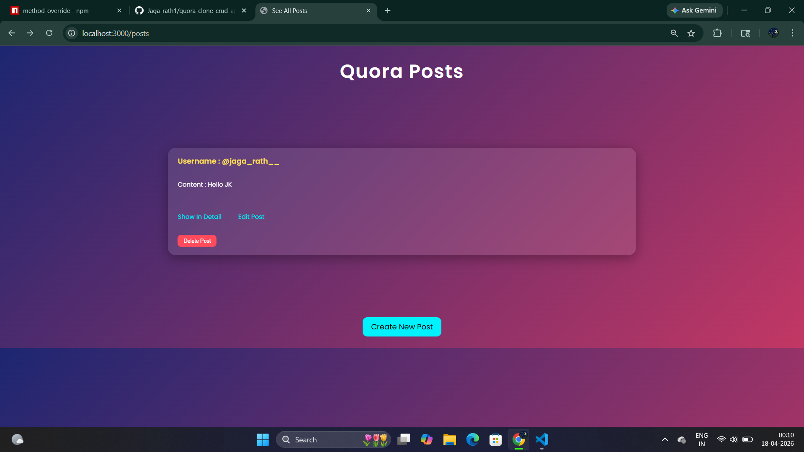
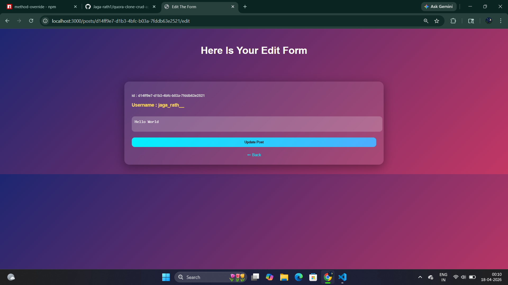
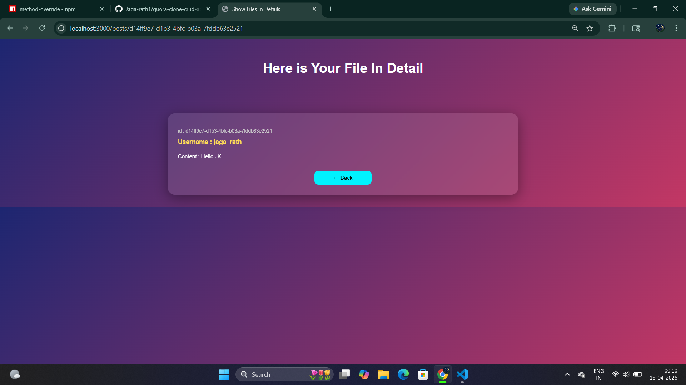

# 🧠 Quora Clone - CRUD App

A simple Quora-style web application where users can create, view, edit, and delete posts.

---

## 🚀 Features

* ✍️ Create a new post
* 📄 View all posts
* 🔍 View post details
* ✏️ Edit existing post
* ❌ Delete post

---

## 🛠️ Tech Stack

* Node.js
* Express.js
* EJS (Template Engine)
* HTML, CSS

---

## 📁 Project Structure

```
quora-post/
├── public/
├── views/
├── index.js
├── package.json
```

---

## ▶️ How to Run

1. Clone the repository

```
git clone https://github.com/your-username/quora-clone-crud-app.git
```

2. Install dependencies

```
npm install
```

3. Run the server

```
node index.js
```

4. Open in browser

```
http://localhost:3000/posts
```

---

## 📸 Screenshots







---

## 💡 Future Improvements

* Add database (MongoDB)
* User authentication
* Like & comment system
* Deploy online

---

## 🙌 Author

Made with ❤️ by You
